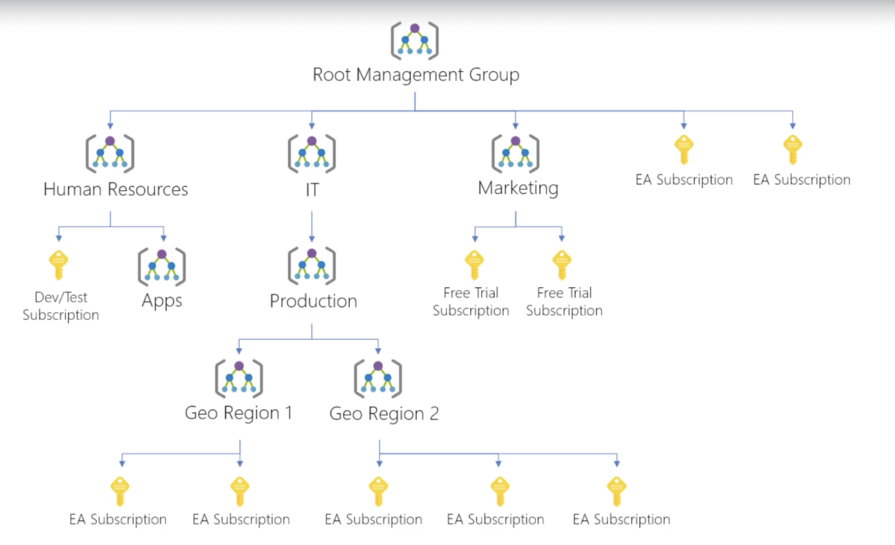
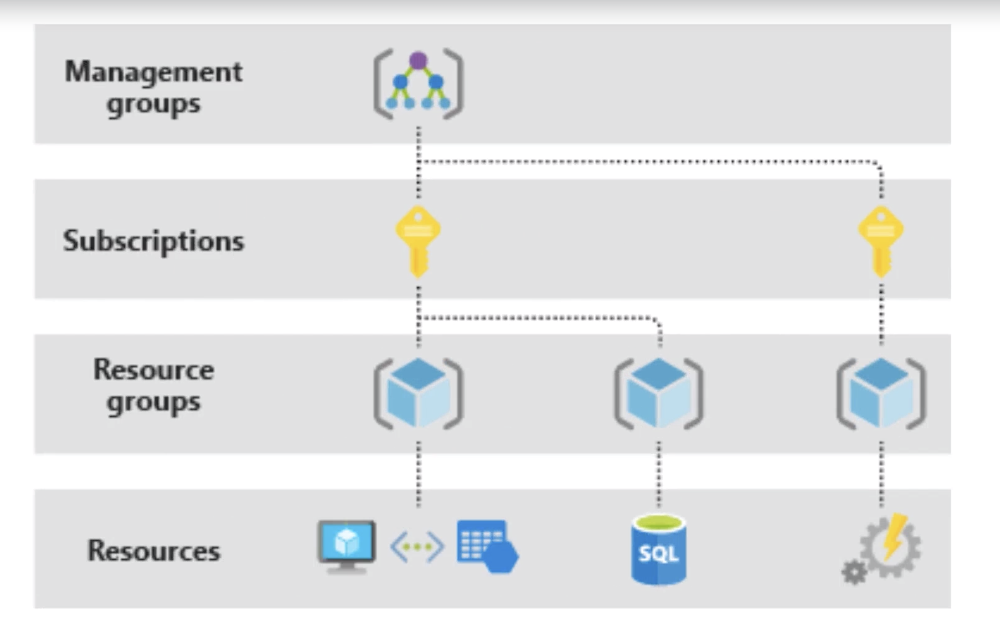

# Subscription and Resources

## Subscription
Subscription is the level at which billing happens.  Resources are billed to which sub you have.  

Companies can create multiple subscriptions.  There are limits (max number of storage acct or VM) for each subscriptions.  Just create a second sub and connec them together for billing.  

Multiple subscriptsion can be organized into management group.  An example for managing 10 subscriptions, as represented by the yellow keys:  

  

### Subscription Options  

- enterprise agreement
- pay as you go - also credits for MSDN subscription, bizspark, students, etc
- free plan
- buy from CSP microsoft partner, which included with the cost of a solution for privately negociated prices  

You can create additional subscription based on Azure Blueprints, a template for standardized for replicating additional subscriptions.

- assign and configure roles and permissions
- set up policy to restrict the account or resource groups 

## Account   
- account is the person, the user id/password  
- the subscription is how the person get charged. many accounts can use the same subscription  

 

- subscriptions contain resources   
- resource groups container isolated resources  
- resources must be in resource groups  
- RG good for boundary for permissions and reporting  
- tagging metaphor for resources for environment, scripting, billing

