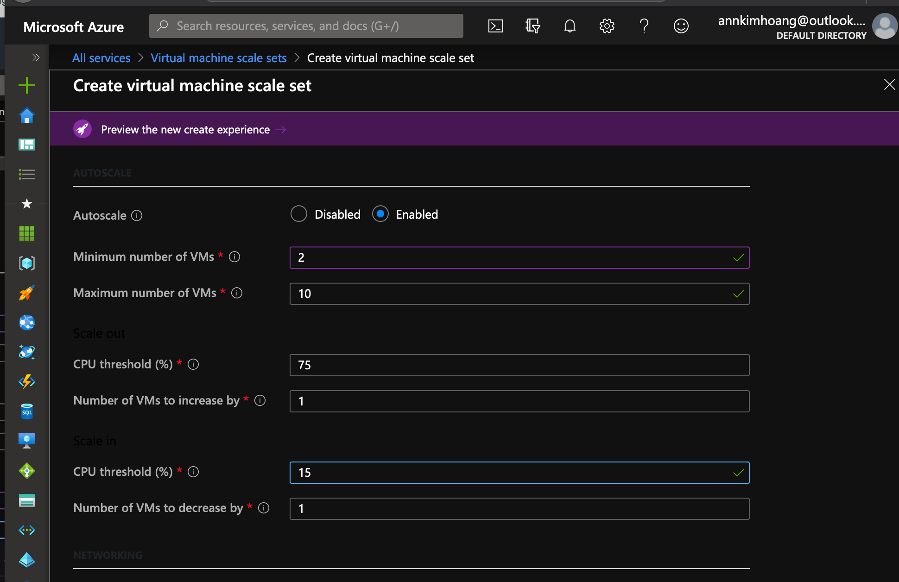

# AZ-300 Create and Configure Virtual Machines

## What is a Virtual Machine?  
a server that looks and behaves for all intents, like real machine. You can control it by RDP or SSH.  

+ there are 120+ config to choose from - instance sizes  
+ categorized into 6 instance types

### Instance Types
Series of instance types B, D, DS, A, DC  

1. general purpose, balanced CPU-to-memory ratio (B, D, DS, A, DC)
2. compute optimzed, high CPU-to-memory ratio  (F, FS) 
3. memory optimized, high memory-to-CPU radio (E,ES,M,G,GS,D*,DS*) 
4. storage optimized, high disk throughput and IO (LS)
5. GPU - VMs for graphic rendering (N series, NV, NC, ND)
6. high performance compute - fastest and most powerful (H)

## Configure a VM for Availability  

Configuring Availability Set:  
**Fault domain** -  VM in the same fault domain shares the same physical power source and network switch.  Add 2 or more means each VM is in 2 physically separated machine. 

**Update domain** - schedule rollouts of windows and Azure fixes. Deploy from 1-20 segments, so it can be rebooted for patches.  Patches will affect a small subset of your machine.

If you use availability zones--such as 3 zones in one region, remember that load balancing is not automatic.  You will still need to deploy a load balancer.  

### SLA for Virtual Machines

- for any single instance of VM, Azure guarantee VM connectivity of at least 99.9%  (3 nines, ~44 mins downtime a month)
- for all VM with 2 or more instances in the same Availability Set, Azure guarantee at least 99.5% (3 and a half nines, ~22 mins downtime per month)
- for all VM that have 2 or more instances across 2 or more AZ, Azure guarantee 99.99% (4 nines, ~4.38 mins downtime per month)   


## Monitor a VM 

- Use diagnostics settings under Monitoring tab for the VM instance  
- metrics option to look at data disk read, write and built graph and pin to dashboard  

## Setting up a VM Scale Sets (VMSS)

- for deploying a fleet from 1-1000 VMs, able to config availability zone and autoscaling

- set scaling rules like CPU threshold to increase or decrease the machine number  

  

- also have load balancing options  

## Encrypting VM
[Microsoft Docs on VM Encrypt Disk](https://docs.microsoft.com/en-us/azure/virtual-machines/windows/encrypt-disks)   

1. First create a key vault in Azure.  Search for resource "key vault."  Make sure the key vault is in the same region as your VM you want to encrypt.    
2. Go to Settings >> Keys >> Generate/Import and create an RSA with RSA key size 2048.  
3. Launch a VM in the same region as the key vault.  
4. Start Azure Powershell >_ and input these commands:  

```powershell
# replace the vault name and resource group name from your own name
$keyVault = Get-AzKeyVault -VaultName "web-manage" -ResourceGroupName "webManageRG";

$diskEncryptionKeyVaultUrl = $keyVault.VaultUri;
$keyVaultResourceId = $keyVault.ResourceId;

$keyEncryptionKeyUrl = (Get-AzKeyVaultKey -VaultName "web-manage" -Name "az-disk-encryption").Key.kid;

$rgName = "webResourceGroup";
Set-AzVMDiskEncryptionExtension -ResourceGroupName $rgName `
    -VMName "anotherTestVM" `
    -DiskEncryptionKeyVaultUrl $diskEncryptionKeyVaultUrl `
    -DiskEncryptionKeyVaultId $keyVaultResourceId `
    -KeyEncryptionKeyUrl $keyEncryptionKeyUrl `
    -KeyEncryptionKeyVaultId $keyVaultResourceId
```

To check, go to VM >> Settings >> Disks and view the Encryption value.  It should be "Enabled."  
