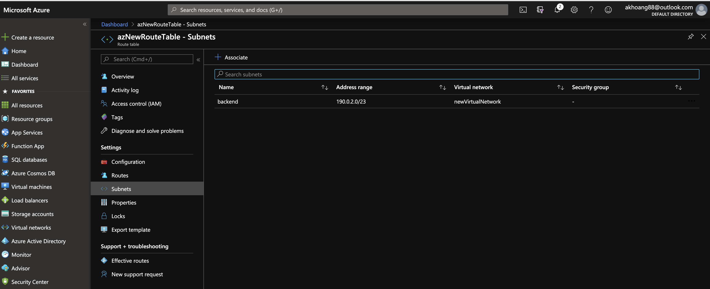
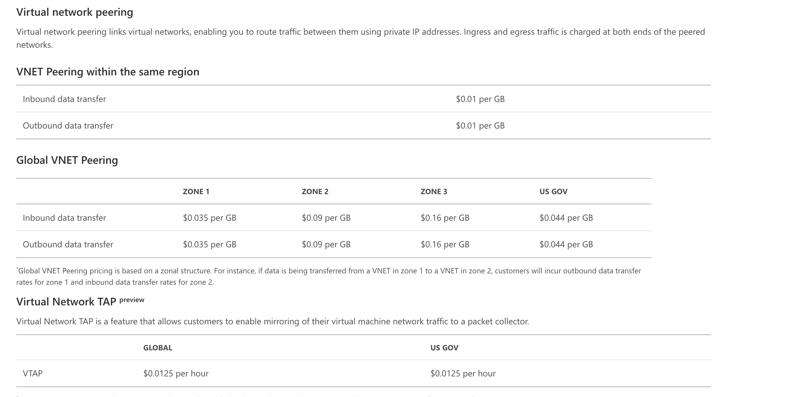
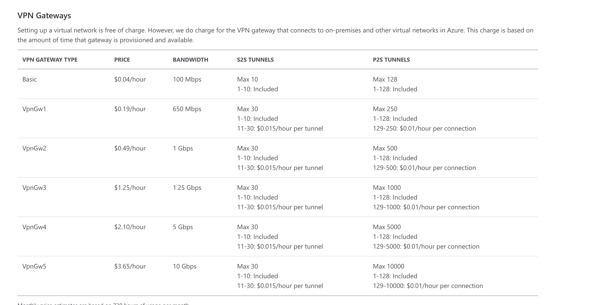
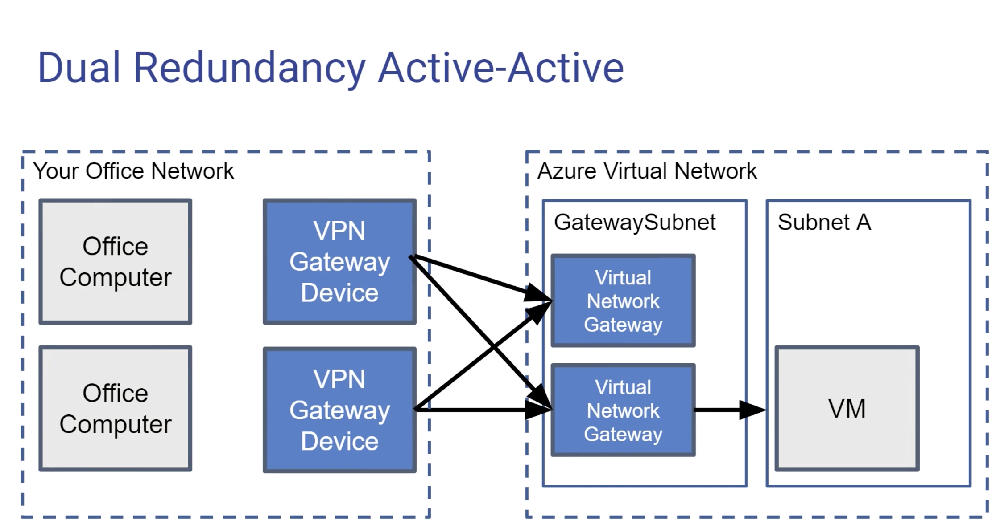
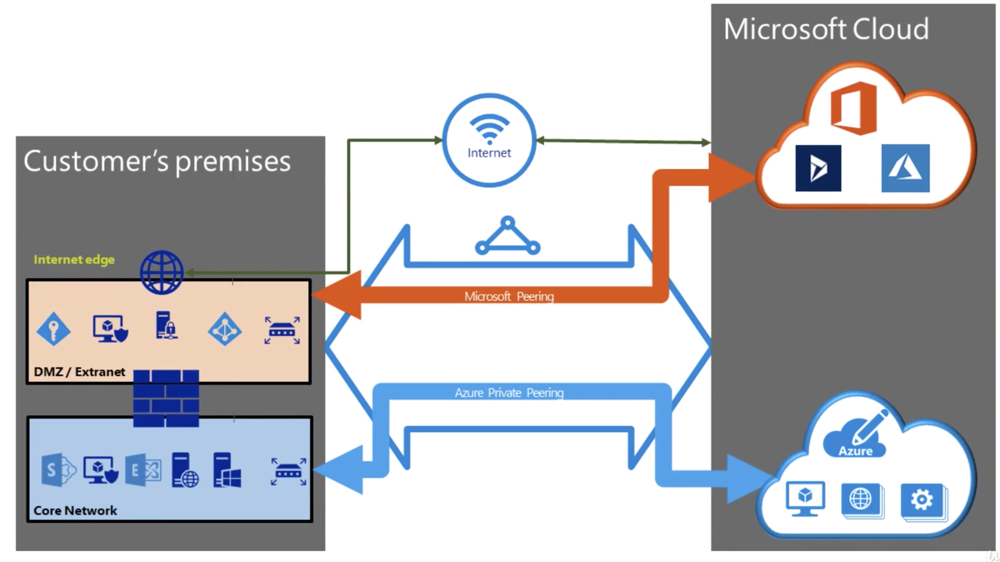

# Virtual Network

## Create a virtual network with subnets
1. Create new virtual network with one default subnet named frontend (public subnet).  For example: 190.0.0.0/16 as the virtual network.  190.0.0.0/23 for frontend subnet. 
2. Create another subnet -- call this one backend (private subnet).  190.0.2.0/23 for backend subnet.
3. Create a new public IP address and give it a dns label.  
4. Create a new route table and add a route that routes all backend private subnet traffic to "Virtual appliance" as the hop type (this will be the firewall) and give the IP of this virtual appliance/firewall.  Asumming you already have a firewall or just assign it to a new unused IP address for now.  Assume 190.0.2.0/23 is the address for private subnet and 190.0.4.1 is our firewall.    
5. Associate route table with backend private subnet.     
 

## VNET Peering
Peering is when you connect two virtual networks together. This means all the resources in one virtual network can access the resources in another network and vice versa.

Azure supports the following types of peering:    

**Virtual network peering**: Connect virtual networks within the same Azure region.  
**Global virtual network peering**: Connecting virtual networks across Azure regions.      
### To Add Peering 

Two types of peering:  
1. VNET Peering within the same region: 0.01 per GB for inbound and outbound transfer.  
2. Global VNET Peering:
		- inbound and outbound have different costs    
crai

When we use VN Gateway to connect to a network, we are using the same tech to connect.  From your corporate on-premise network into Azure, use VN Gateway from the Azure end to connect to the physical gateway from your on-premise network.   

ForVPN Gateway Type (VNET-to-VNET connection) - this is charged based on time provisioned and available.    

  
 On each VN network, create a virtual gateway subnet.  Provision a subnet for the gateway.  Create a vpn gateway and it will create a new subnet.  

### Virtual Private Networks (VPN)  

VPN is a connection btw your computer and a virtual network within Azure or a whole network of computers and a virtual network with an Azure VPN.

- private, meaning end-to-end encryption of traffic  
- does travel across internet, but encrypted  

Options within Azure:  
1. Point to Site (P2S) VPN  
	[your computer] with VPN client ---> [Azure Virtual Network] with GatewaySubnet with a Virtual NetworkGateway    
	- common for work at home, telecommuniting     
	- not persistent, inconvenient   

	 

2. Site to Site (S2S) VPN 
	 

	- connect an entire office to Azure  
	- you need a physical VPN Gatewway Device on your office network 
	- **Additional features**: 
		supports redudancy - by default, Azure sets up double connection  
		multiple gateways - many gateways to connect to a single Azure VN Gateway
		active-active  -single gateway device connect to multiple Azure VN Gateway 

		  
   
3. ExpressRoute  
	- private connection btw your connection and Azure running with ISP, work with a comms provider to set up
	- extremely fast and also expensive  
	- depending on service to connect to, you use Azure Private Peering for Azure services and Microsoft Peering for Microsoft Cloud 
	
4. ExpressRoute Direct  

